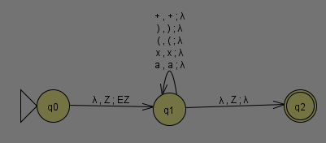

Nora Mohamed

[x] the internet helped me

---
## 1a
_a_ | _b_ | _a_ XOR (b XOR a)
----|-----|---
 F  |  F  | F
 F  |  T  | T
 T  |  F  | T
 T  |  T  | F

## 1b

_a_ | _b_ | _a_ XNOR _b_
----|-----|---
 F  |  F  | T
 F  |  T  | F
 T  |  F  | F
 T  |  T  | T

---
## 2

## 3
E -> E + E | (E) x T | T x (E) | (E) x (E) | (E) | T
T -> a

## 4
No. (a+**a)xa** --> (a+**a)xaa)xa** --> not possible

## 5

Theorem 1: The language {a^n b^n c^n} is not a context-free language.

a. Use Theorem 1, together with the languages {a^i b^i c^j} and {a^i b^j c^j}, to show that the set of context-free languages is not closed under intersection.

b. Use the pumping lemma for context-free languages [Sipser pp. 125] to prove Theorem 1.

## 6

S -> NP VP
NP -> NP PP
NP -> DET N
VP -> V NP
VP -> VP PP
DET -> a | the
N -> boy | girl | flowers | binoculars
V -> touches | sees
PP -> P NP
P -> in | from | with
a. Show that the string "the girl touches the boy with the flower" has two different leftmost derivations.

b. Describe in English the two different meanings of this sentence.

c. Use G to generate another ambiguous sentence.

d. Modify G so that it generates strings with adjectives: the girl saw the tall boy, the girl touches the boy with a purple flower.