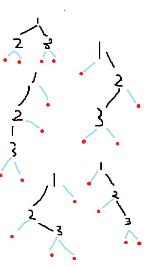

# FOCS Homework 15, for Day 15

You may edit your answers into this file, or add a separate file in the same directory.

If you add a separate file, please include the following at the top:

```
Student Name: Nora Mohamed
Check one:
[ ] I completed this assignment without assistance or external resources.
[ ] I completed this assignment with assistance from ___
   and/or using these external resources: ___
```


## I. Binary search tree ordering


Assume that the following tree structures are all properly constructed binary search trees, preserving the binary search property that any (internal) node's left child is smaller than the internal node and its right child is larger (or of equal value).  

Anything labeled with a T can be assumed to be a (possibly empty) subtree (i.e., may contain zero or more nodes); anything labeled with a lower case letter is a single node.

What inequalities must hold in each of these trees?

### 0.
```
        a
       / \
      /   \
    T1     T2
```

Ans:  all elements of TI <= x <= all elements of T2

### 1.
```
        b
       / \
      /   \
     c     T3
    / \
   /   \
 T1    T2
```

Ans:  T1 <= c <= T2 <= b <= T3


### 2.
```
        d
       / \
      /   \
    T1     e
          / \
         /   \
       T2    T3
```

Ans:  T1 <= d <= T2 <= e <= T3


### 3.
```
        f
       / \
      /   \
     g     T4
    / \
   /   \
 T1     h
       / \
      /   \
    T2     T3
```
Ans:  T1 <= g <= T2 <= h <= T3 <= f <= T4


## II.  Extending this analogy:  drawing trees.

### 4. 

What other tree structures containing three internal nodes -- x, y, and z -- can exist?  Draw these and describe the inequalities that exist among the internal nodes and their subtrees.  
[Hint:  There should be four more shapes.]  
The relationship among x, y, and z doesn't matter.  For convenience, we've arbitrarily labeled them top to bottom and the subtrees left to right. (question is confusing)

a. Tree with node that leads to only one other node.

b. Heap tree, where if A is a parent node of B then the value of A is ordered with respect to the value of node B with the same ordering applying across the heap 

c. AVL tree 

d. Binary search trees (two versions are with lower number being on right, or lower number being on left). Types of binary search trees: 





## III.  Observing balance

It is desirable for binary search trees to be balanced (or close).  If we assume that each of the T structures has the same depth, the two-internal-node trees have the following property:

For EVERY internal node (x and y), the depth of the internal node's left subtree and the depth of the internal node's right subtree differ by at most 1.  We call these trees almost-balanced.  


### 5. 

Does this property hold for any of the three-internal-node trees?  Which ones?  Which ones are NOT almost-balanced?  (We call these unbalanced.)

Almost-balanced: 1, 2

Unbalanced: 3

## IV.  Maintaining balance


Observe the following:

If you are given a binary tree of the form in question 1, you can transform them into the form in question 2 (and vice versa) while preserving the binary search property.  
[Since they are both almost-balanced, this doesn't help, but it also doesn't hurt.]  

### 6. 

Use this insight to show how to modify each of the unbalanced tree forms with three internal nodes into an almost-balanced tree that preserves the binary search property.

```
        h
       / \
      /   \
     g     f
    / \   / \
   /   \ /   \
 T1   T2 T3   T4
```
T1 <= g <= T2 <= h <= T3 <= f <= T4

## V.  Rebalancing

### 7. 

Verify that the following tree is almost-balanced:

For EVERY internal node (x and y), the depth of the internal node's left subtree and the depth of the internal node's right subtree differ by at most 1. 

```
         8
        / \
       /   \
      6     14
     /\      /\  
    /  \    /  \ 
   3   7   12   16  
  /\       /    /\ 
 /  \     /    /  \ 
2    5   10   15   20
                   /
                  /
                 18
```

Internal Node -> left dept, right depth

* 8 -> 3, 4
* 6 -> 2, 1
* 3 -> 1, 1
* 14 -> 2, 3
* 12 -> 1, 0
* 16 -> 1, 2
* 20 -> 1, 0
* 15 -> 0, 0
* 10 -> 0, 0
* 7 -> 0, 0


### 8. 

Insert the value 13 into this tree.  Where does it go?  Is the resulting tree almost-balanced?  If not, see #11.

```
         8
        / \
       /   \
      6     14
     /\      /\  
    /  \    /  \ 
   3   7   12   16  
  /\       /\   /\ 
 /  \     /  \ /  \ 
2    5   10  1315   20
                   /
                  /
                 18
```

Yup

### 9. 

Insert the value 17 into the tree.  Where does it go?  Is the resulting tree almost-balanced?  If not, see #11.

```
         8
        / \
       /   \
      6     14
     /\      /\  
    /  \    /  \ 
   3   7   12   16  
  /\       /    /\ 
 /  \     /    /  \ 
2    5   10   15   18
                   /\
                  /  \
                 17  20
```
Re-balanced

### 10. 

Insert the value 4 into the tree.  Where does it go?  Is the resulting tree almost-balanced?  If not, see #11.

```
         8
        / \
       /   \
      5     14
     /\      /\  
    /  \    /  \ 
   3   7   12   16  
  /\   /   /    /\ 
 /  \ /    /    /  \ 
2   4 6  10   15   20
                   /
                  /
                 18
```

Re-balanced

### 11. 

Use the work you've done above to rebalance the tree.  Start at the newly inserted value; work up until you find an internal node that has left and right children whose depth differs by more than one.  Rebalance that subtree using the processes you created in #6.  Continue to climb the tree, rebalancing any unbalanced (not almost-balanced) nodes as you go up.


### 12. 

[Challenge] Assuming that a tree is almost-balanced when you make an insertion, and that that insertion may violate the almost-balanced property, can almost-balance always be restored solely by climbing the  path from the newly inserted node to the root?  Will you ever have to descend another branch?  Why or why not?

Assuming this question is stating that I can't switch values, then no, I'd traverse up the tree and eventually have to place is on the side of a branch. Really depends on where I'm trying to place it.