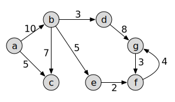

# FOCS Homework 17

## 1. Spanning Trees
#### Note: my answer to this and problem 2 are in `bfs_with_obj_nodes`
This is a Python rendition of the BFS pseudocode from the in class exercise:

``` python
def bfs(graph, start):
    """Graph breadth-first search.
    
    1. create a sequence that contains only node a
    2. until the collection is empty:
    3.    remove node n from the head of the sequence and visit it
    4.
    5. to visit a node:
    6.    add unvisited adjacent nodes to the tail of the sequence"""
    remaining_nodes = Queue()
    visited = set()

    def visit(node):
        print(node)
        visited.add(node)
        for tail in graph.successors(node):
            if tail not in visited:
                remaining_nodes.put(tail)

    remaining_nodes.put(start)
    while not remaining_nodes.empty():
        n = remaining_nodes.get()
        visit(n)
```
`bfs` prints the nodes as it visits them.

Modify this function to construct a [spanning tree](https://en.wikipedia.org/wiki/Spanning_tree) instead.

You can use one of two strategies to represent the spanning tree:

1. Add a `parent` attribute to each node: `node.parent = …` .  This adds a set of references to the existing nodes. The `parent` attributes define a path from each leaf or internal node of the spanning tree, to the BFS start (the tree's root).
2. Construct a *new* graph. Add nodes and edges to it. This graph is a [spanning subgraph](https://en.wikipedia.org/wiki/Glossary_of_graph_theory#subgraph). You may use the [graph abstract data type operations](https://en.wikipedia.org/wiki/Graph_(abstract_data_type)#Operations) of the input graph to construct the tree.

You can do this in any programming language. If you choose to use Python, you can use these files to test your code:

* `graph.py` contains an implementation of the graph data type and the `bfs` function. The test code uses strings `'a'`, `'b'`, as nodes.
* `bfs_with_obj_nodes` is an alternate implementation that uses objects as nodes, and contains some utility functions that makes node objects easier to work with. If you add attributes to the nodes (instead of creating a new graph), you'll want to use `bfs_with_obj_nodes`, since you can't add an attribute to a string.

## 2. Single-Source Distance (without weights) 

Modify the Python code in (1) – or supply your own implementation in another language – so that it records the distance (number of edges) from the start node to each node that a path can reach.

As with (1), there are two ways to do this:

1. Add a `distance` attribute to each node. This requires that nodes are objects.
2. Return a structure that maps nodes to distances. For example: if nodes are represented by single-letter strings `'a'`, `'b'`, `'c'`, etc., then `bfs` could return a dictionary `{'a': 0, 'b': 1, 'c': 1}`.

The first strategy is a relatively straight-forward implementation of [this algorithm](https://en.wikipedia.org/wiki/Breadth-first_search#Pseudocode).

## 3. Single-Source Distance With Weights

Read about Dijsktra's Algorithm in your favorite algorithm text, or [Wikipedia](https://en.wikipedia.org/wiki/Dijkstra%27s_algorithm#Algorithm). Apply it (manually) to the following graph. How does it label the nodes?



It labels nodes as visited or unvisited, for if you've looked at the neighbors of that node. It also labels the node that you're currently on. The next current node is the next node in the unvisited category that has the lowest distance.

```
a: 0
b: infinity
c: infinity
d: infinity
e: infinity
f: infinity
g: infinity

visited
unvisited
(current) a: 0
b: infinity
c: infinity
d: infinity
e: infinity
f: infinity
g: infinity

visited
unvisited
(current) a: 0
b: 10 < infinity --> 10
c: 5 < infinity --> 5
d: infinity
e: infinity
f: infinity
g: infinity

visited
a: 0
unvisited
(current) c: 5
b: 10
d: infinity
e: infinity
f: infinity
g: infinity

visited
a: 0
c: 5
unvisited
(current) b: 10
d: (10 + 3) < infinity --> 13
e: (10 + 5) < infinity --> 15
f: infinity
g: infinity

visited
a: 0
c: 5
b: 10
unvisited
(current) d: 13
e: 15
f: infinity
g: (13 + 8) < infinity --> 21

visited
a: 0
c: 5
b: 10
d: 13
unvisited
(current) e: 15
f: (15 + 2) < infinity --> 17
g: 21

visited
a: 0
c: 5
b: 10
d: 13
e: 15
unvisited
(current) f: 17
g: (17 + 4) = 21 --> 21

visited
a: 0
c: 5
b: 10
d: 13
e: 15
f: 17
unvisited
(current) g: 21

visited
a: 0
c: 5
b: 10
d: 13
e: 15
f: 17
g: 21
unvisited
```


## 4. Reading: Graphs
One of:

* Cormen *et al.* Section 6 “Graph Algorithms”, Chapters 22-24.
* Rawlins pp. 305-342
* Equivalent material in your favorite data structures text: graphs, spanning trees, bread-first search, depth-first search, Dijskstra's algorithm.
* Wikipedia: [Graph](https://en.wikipedia.org/wiki/Graph_(discrete_mathematics)), [graph data type](https://en.wikipedia.org/wiki/Graph_(abstract_data_type)), [directed graph](https://en.wikipedia.org/wiki/Directed_graph), [adjacency matrix](https://en.wikipedia.org/wiki/Adjacency_matrix), [bread-first search](https://en.wikipedia.org/wiki/https://en.wikipedia.org/wiki/Breadth-first_search), [depth-first search](https://en.wikipedia.org/wiki/Depth-first_search)
## 5. (Optional) Reading: Dynamic programming

One of:

* Cormen et al. Chapters 15-16
* Equivalent material in your favorite algorithms text: dynamic programming, greedy algorithms
* [Last restort – this is not one of the articles that is easy to learn from] Wikipedia: [Dynamic programming in computer programming](https://en.wikipedia.org/wiki/Dynamic_programming#Dynamic_programming_in_computer_programming)
