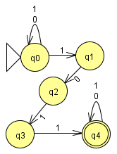
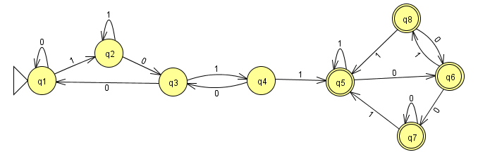
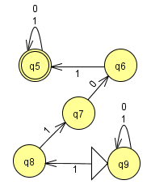

# HW 6

## 1. Nondeterministic automaton

[prob1.jiff](prob1.jff)

## 2. Conversion to deterministic automaton

[prob2.jiff](2.jff)

Nondeterministic:

|   | `0` | `1` |
|---|---|---|
| **q0** | q0 | q0,q1 |
| q1 | q2 | - |
| q2 | - | q3 |
| q3 | - | q4 |
| *q4* | q4 | q4 |

Possibly paths each states can go to:

|   | `0` | `1` |
|---|---|---|
| **0** | 0 | 0,1 |
| 0,1 | 0,2 | 0,1 |
| 0,2 | 0 | 0,1,3  |
| 0,1,3 | 0,2 | 0,1,4 |
| *0,1,4* | 0,2,4 | 0,1,4 |
| *0,2,4* | 0,4 | 0,1,3,4 |
| *0,4* | 0,4 | 0,1,4 |
| *0,1,3,4* | 0,2,4 | 0,1,4 |

Creating new states:

|   | `0` | `1` |
|---|---|---|
| **q1** | q1 | q2 |
| q2 | q3 | q2 |
| q3 | q1 | q4  |
| q4 | q3 | q5 |
| *q5* | q6 | q5 |
| *q6* | q7 | q8 |
| *q7* | q7 | q5 |
| *q8* | q6 | q5 |

## 3. Larger alphabet
Yes it would be more complex. There are more possible inputs, meaning there are more possible states for you to handle. Even if the machine only uses `a` and `b`, it still has the capability to accept `c`, `d`, etc., which makes provides the machine with more options for execution.

## 4. [*] Challenge: Reverse

You would have to reverse everything in your machine. The start becomes the finish, and the end becomes the start. You also have to reverse the direction that every arrow is pointing.

## 5. Reading
✓

## 6. Regular Expression Practice
`0*10*`